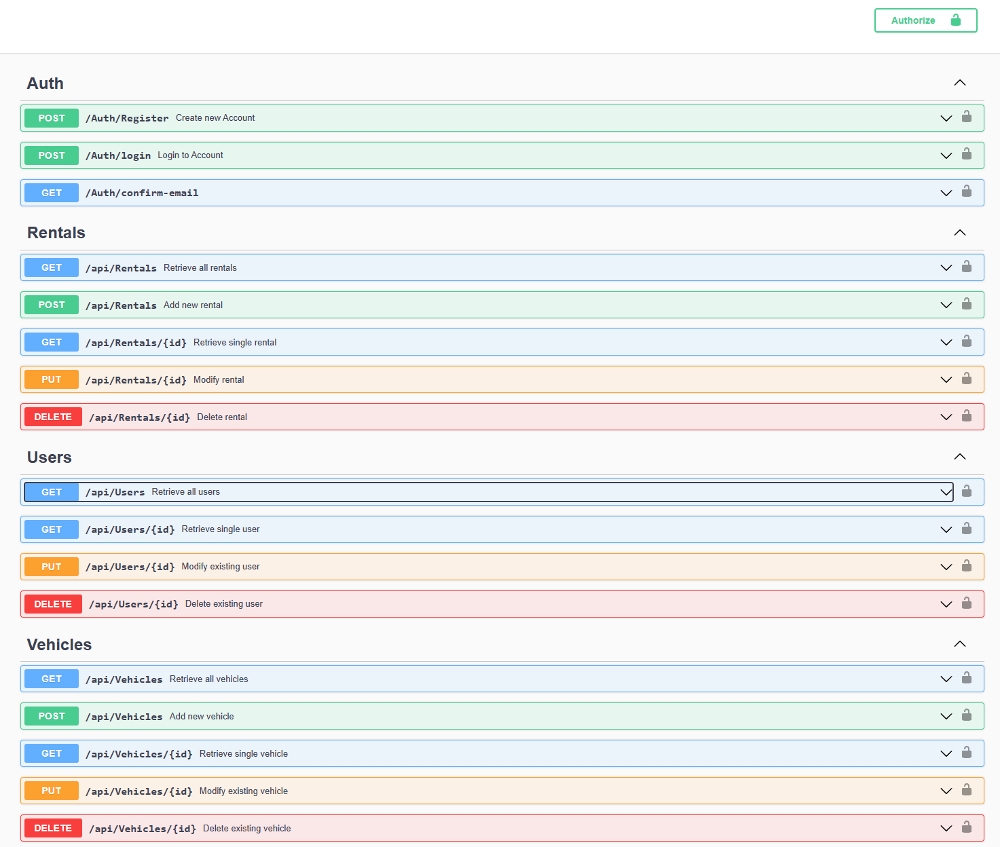
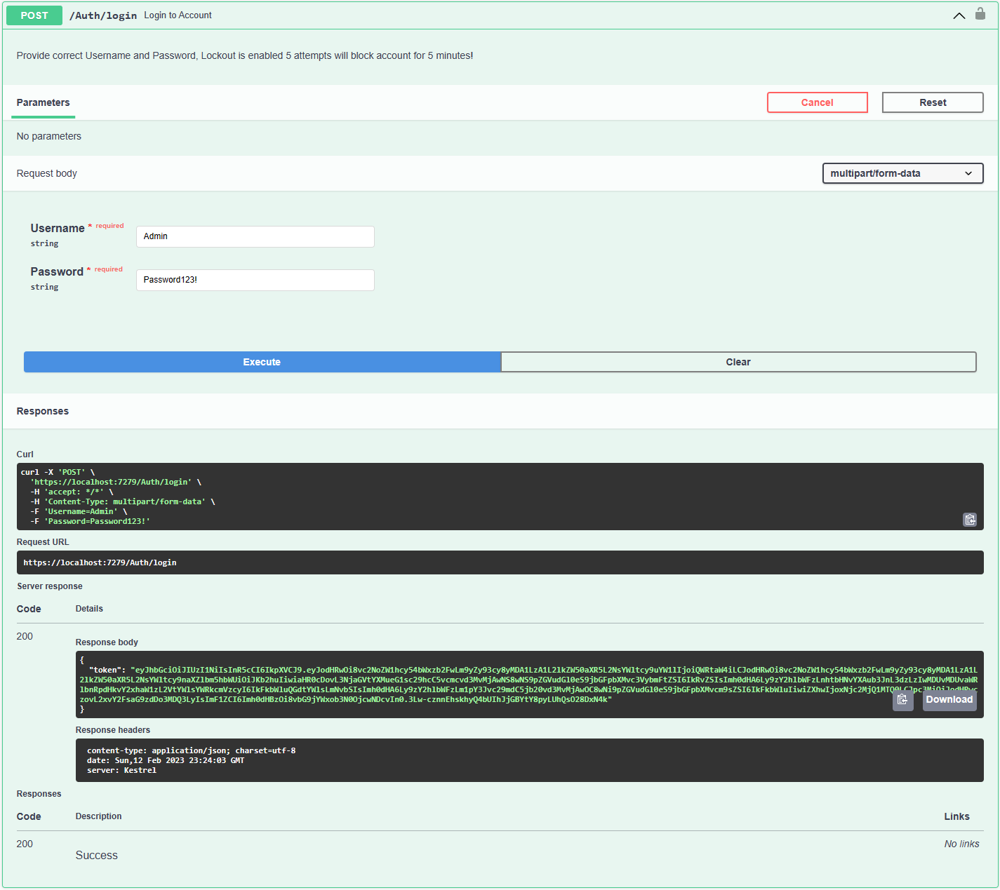
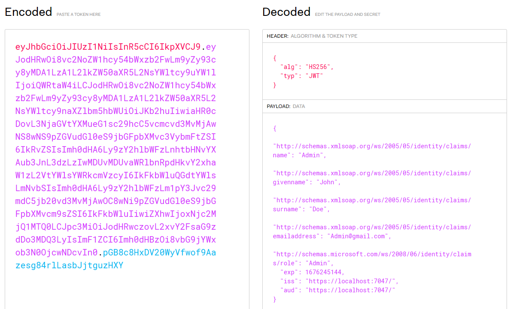
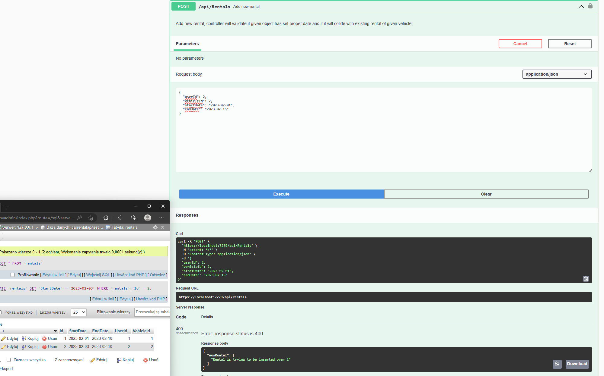

# CarRentalAPI

## Disclaimer
This project is being remade from ground up, with completly new features like: N-Tier architecture, MediatR and more. New repository will be available soon 😉

## Summary
Simple Web API, providing controllers with endpoints to perform CRUD operations on __Vehicles__ and __Rentals__ data tables using Entity Framework and Unit Of Work pattern, to ensure that all database changes are performed as a single transaction, reducing the risk of data corruption.

## Features
* Authentication/Authorization using JWT Bearer
* Entity Framework
* Unit Of Work
* User identity with roles and lockout features <!-- /PasswordChange/EmailChange) -->
* Email confirmation with SMTP
* Robust validation to ensure new rentals do not conflict with existing ones
* Automatic database migration
* User seeding with assigned roles
* Documentation

# Images

## Home

## Login

## Token

## Rental add over existing one

